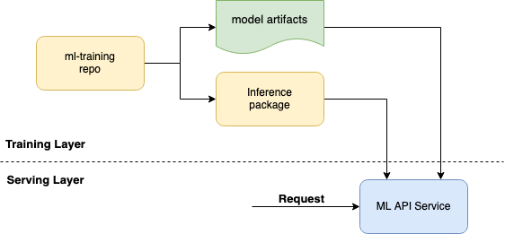

# Serving Machine Learning Models

When serving machine learning models, data preparation and model training are just two factors to consider. This repository explores how to serve a machine learning (ML) model using a Rest API.

To know more about model training, please check the [machine learning model training proposed solution](https://github.com/dlite-tools/nlp-training).

The objective of this repository is to propose an approach serve a machine learning model using a Rest API built with [FastAPI] and using a inference package created in [model training proposed solution](https://github.com/dlite-tools/nlp-training). This way we ensure that the data transformation is done the same way as the training process.

# Architecture



# Project Setup

The backbone of our REST API will be:
- [FastAPI](https://fastapi.tiangolo.com/) - lets you easily set up a REST API.
- [Uvicorn](https://www.uvicorn.org/) - server that lets you do async programming with Python.
- [Pydantic](https://pydantic-docs.helpmanual.io/) - data validation by introducing types for our request and response data.

Some tools will help us write some better code:

- [flake8](https://flake8.pycqa.org/en/latest/) - check for code style (PEP 8) compliance
- [mypy](https://mypy.readthedocs.io/en/stable/) - check for type annotations
- [pydocstyle](http://www.pydocstyle.org/en/stable/) - check for docstring style compliance

# Install dependencies

We will use [Poetry](https://python-poetry.org/) to manage our dependencies and create a virtual environment for the project.

```
poetry install
```

You can use other tools, like Pipenv, to manage your python virtual environments using the `requirements.txt`.

# Run the server

We can run the FastAPI app using the following command:

```
make api
```

What will be executed with this command is:

```
uvicorn src.main:app --no-access-log --log-level info --host 0.0.0.0 --port 5000 --reload --reload-dir src
```

The command starts a local Uvicorn server that automatically reloads for any change in the code.

If you go to the localhost URL http://127.0.0.1.5000 in your browser, you should see a JSON message output.

# Run the server with Docker

To run the API with docker you need to build the docker image and run the container with code bellow. After that, just stop the container.

```bash
docker build --rm --tag api:dev --target production .
```

```bash
docker run --name api-dev -p 5000:5000 --env-file dev.env --rm api:dev
```

```bash
docker stop api:dev
```

The makefile has a shortcut to build, run and stop the API, just execute `make docker-build`, `make docker-run` and `make docker-stop`, respectively.

# Running the Tests

## Running Tests Locally

There is a `Makefile` and `setup.cfg` files with configurations to run basic static, unit, and coverage tests.

| Execute            |     |
|---                 | --- |
| make static-tests  | Run `style`, `typecheck` and  `documentation` analysis |
| make unit-tests    | Run unit tests with coverage analysis under `tests/unit` with `pytest` |

## Running Tests with Docker

To run the tests with Docker execute the following commands:

```bash
docker build --rm --tag api:test --target tester .
docker run --name api-test --rm api:test
```

The makefile has a shortcut to run the tests, just execute `make docker-test`.
